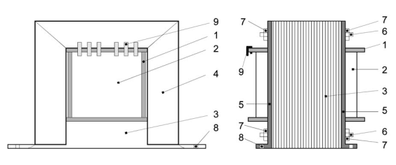
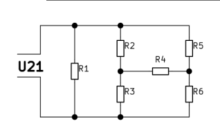
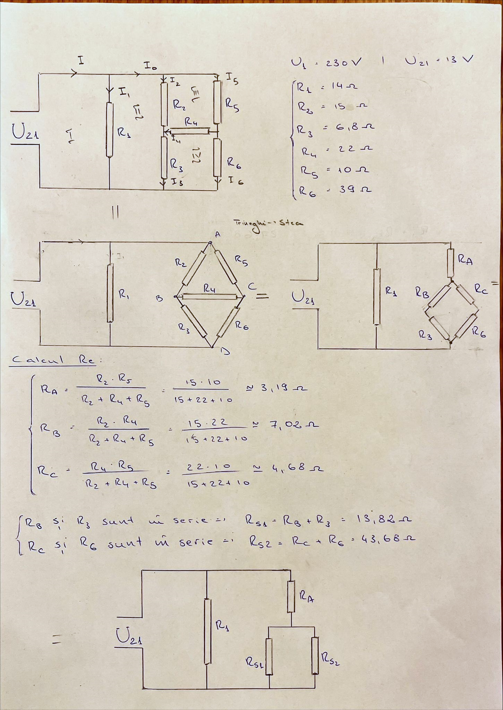
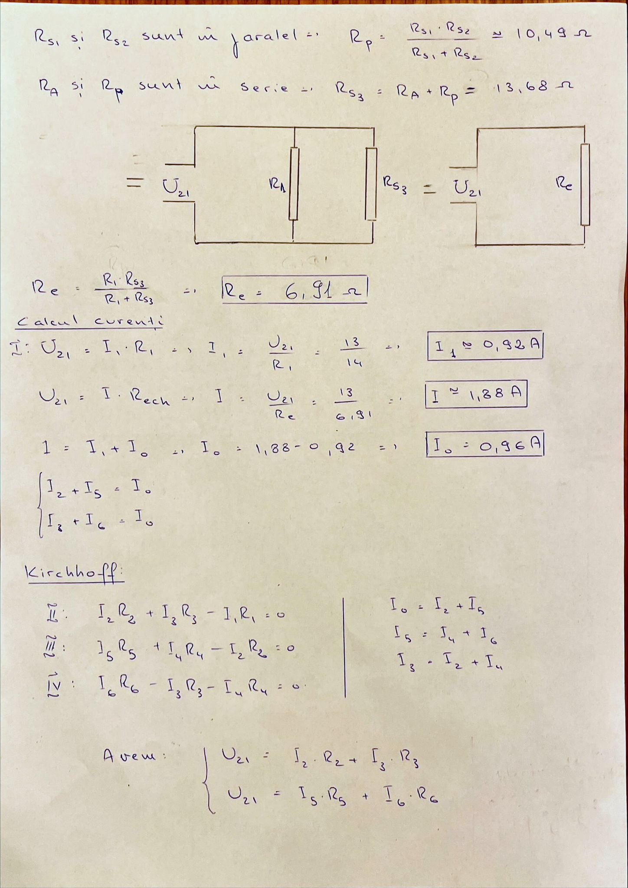

# 📡 Single-Phase Low-Power Network Transformer

## 📌 Project Overview
This project focuses on designing and developing a **low-power (P < 500W) single-phase network transformer**, considering both structural design and manufacturing technology. The transformer is intended for applications requiring **efficient power conversion and electrical isolation**, making it ideal for electronic equipment operating in varying ambient temperatures (10-80°C).

## 🛠 Key Features
- **Voltage & Current Regulation:** Ensures safe and stable operation between the primary and secondary circuits.
- **Galvanic Isolation:** Enhances safety by electrically separating circuits.
- **Ferromagnetic Core:** Uses **laminated silicon steel sheets (E+I type)** for optimal magnetic properties.
- **Robust Construction:** Includes an **insulating casing, windings, and core clamping system** to ensure durability.
- **Low Electromagnetic Emissions:** Offers a reliable alternative to SMPS (Switched-Mode Power Supplies).

## 🎯 Applications
This transformer is suitable for a wide range of electronic devices, including:
- **High-performance audio amplifiers**
- **Measurement instruments**
- **Microwave ovens**
- **Soldering stations**
- **Mobile device chargers**

---

## 🖼 Transformer Diagram

---

## ⚙️ Technical Specifications
| Parameter | Value |
|-----------|-------|
| **Power Rating** | < 500W |
| **Primary Voltage (U1)** | 230V, 50Hz |
| **Core Type** | E+I laminated silicon steel |
| **Temperature Range** | 10 - 80°C |
| **Winding Material** | Copper wire (enameled) |

---

## 🔧 Manufacturing Process
1. **Core Preparation:** Cutting and heat-treating silicon steel sheets.
2. **Casing Construction:** Injection molding or assembly of insulating materials.
3. **Winding Process:** Automated or semi-automated winding of copper wire.
4. **Core Assembly:** Inserting laminated sheets and securing with clamping systems.
5. **Impregnation:** Dipping in polyurethane varnish for thermal and electrical insulation.
6. **Quality Control:** Testing electrical parameters such as resistance, insulation, and voltage transformation ratio.

## 📏 Design Considerations
When designing the transformer, the following factors are considered:
- **Primary & Secondary Voltage (U1, U2)**
- **Number of Turns (N1, N2)**
- **Core Cross-Section (A[mm²])**
- **Winding Resistance (R1, R2, ... R6)**
- **Thermal and Electrical Insulation**

## Transformer Design & Calculations

## 📘 References
1. [Technology and Design of Low-Power Transformers](https://curs.upb.ro/2023/pluginfile.php/211801/mod_folder/content/0/Tehnologia%20si%20proiectarea%20transformatorului.pdf)
2. [Transformer Efficiency - Illustration Prize](https://illustrationprize.com/ro/694-transformer-efficiency.html)
3. [Farnell - Electronic Components](https://ro.farnell.com/)
4. [Scribd - Transformer Manufacturing](https://www.scribd.com/doc/58454244/Proiectarea-Transformatorului-de-Mica-Putere)

---

## 📩 Contact
For any questions or contributions, feel free to reach out!
